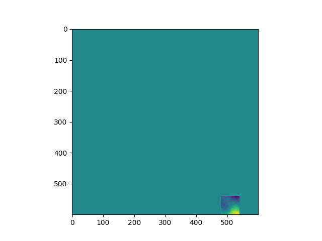

# MapGenerator_OpenSimplex2
Esta es una implementación en 2D para Python del algoritmo de ruido [OpenSimplex2](https://github.com/KdotJPG/OpenSimplex2).

El archivo `main.py` incluye una implementación asíncrona que muestra cómo se generan los chunks. 

Se agradece a [KdotJPG](https://github.com/KdotJPG) y sus colaboradores por compartir el código en otros lenguajes.

------------------------
This is a 2D Python implementation of the [OpenSimplex2](https://github.com/KdotJPG/OpenSimplex2) noise algorithm.

The `main.py` file includes an asynchronous implementation that shows how chunks are generated. 

Thanks to [KdotJPG](https://github.com/KdotJPG) and its collaborators for sharing the code in other languages.

